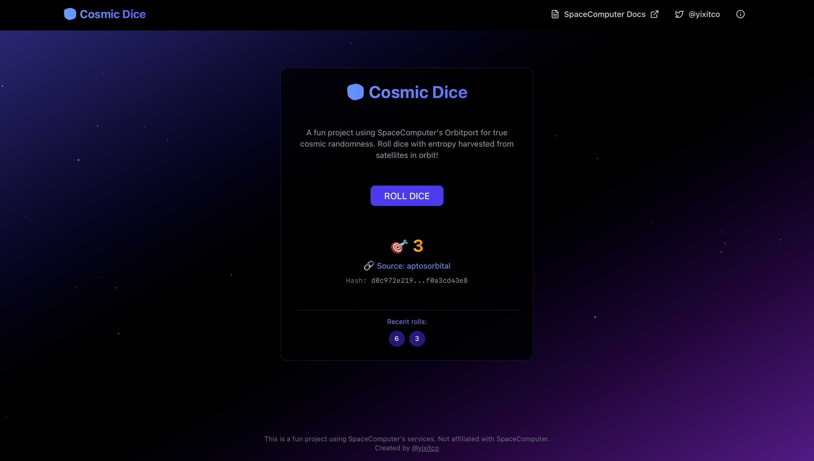

# Cosmic Dice

🎲 Cosmic Dice is a fun and interactive web application that allows users to roll dice with true cosmic randomness, thanks to SpaceComputer's Orbitport which harvests entropy from satellites in orbit!

## ✨ Live Demo

Check out the live demo here: [https://cosmic-dice.netlify.app](https://cosmic-dice.netlify.app)

## ✨ Highlight



## 🚀 Core Features

- True random numbers from satellite hardware via SpaceComputer's Orbitport cTRNG service
- Multiple satellite sources (cEDGE and Crypto2 by Aptos Orbital) for high availability
- Cryptographically signed data to ensure authenticity and prevent tampering
- Local fallback support for high reliability

## 🛠️ Technologies Used

- **Frontend:** [Next.js](https://nextjs.org/), [React](https://reactjs.org/), [TypeScript](https://www.typescriptlang.org/)
- **Styling:** [Tailwind CSS](https://tailwindcss.com/) / [ShadcnUI](https://ui.shadcn.com)
- **Font:** [Geist](https://vercel.com/font) (As it comes with Next.js)
- **Randomness Source:** SpaceComputer's Orbitport

## 🏁 Getting Started

These instructions will help you get a copy of the project up and running on your local machine for development and testing purposes.

### Prerequisites

What you need to have installed to run the project:

- [Node.js](https://nodejs.org/) (v18 or higher recommended)
- [npm](https://www.npmjs.com/) / [yarn](https://yarnpkg.com/) / [pnpm](https://pnpm.io/) / [bun](https://bun.sh/) (Your package manager of choice used in the project)

### Installation

1.  Clone the project:

    ```bash
    git clone https://github.com/username/cosmic-dice.git
    cd cosmic-dice
    ```

    (Replace `username` with your actual GitHub username if this is a fork or your own repository)

2.  Create a `.env.local` file in the root directory with the following content:

    ```bash
    OP_AUTH_URL=
    OP_CLIENT_ID=
    OP_CLIENT_SECRET=
    ```

3.  Install dependencies:

    ```bash
    npm install
    # or
    yarn install
    # or
    pnpm install
    # or
    bun install
    ```

4.  Run the development server:

    ```bash
    npm run dev
    # or
    yarn dev
    # or
    pnpm dev
    # or
    bun dev
    ```

5.  Open [http://localhost:3000](http://localhost:3000) with your browser to see the application.

You can start editing the page by modifying `app/page.tsx`. The page auto-updates as you edit the file.

This project uses [`next/font`](https://nextjs.org/docs/app/building-your-application/optimizing/fonts) to automatically optimize and load [Geist](https://vercel.com/font), a new font family for Vercel.

## 🤝 Contributing

Contributions are what make the open-source community such an amazing place to learn, inspire, and create. Any contributions you make are **greatly appreciated**.

If you have a suggestion that would make this better, please fork the repo and create a pull request. You can also simply open an issue with the tag "enhancement".
**Don't forget to give the project a star! Thanks again!**

1.  Fork the Project
2.  Create your Feature Branch (`git checkout -b feature/AmazingFeature`)
3.  Commit your Changes (`git commit -m 'Add some AmazingFeature'`)
4.  Push to the Branch (`git push origin feature/AmazingFeature`)
5.  Open a Pull Request

Please ensure your PR adheres to the project's coding standards and guidelines.

## 📜 License

This project is licensed under the [MIT License](LICENSE.md). See the `LICENSE.md` file for details. (If you plan to add a license file, uncomment this line and create a `LICENSE.md` file.)
